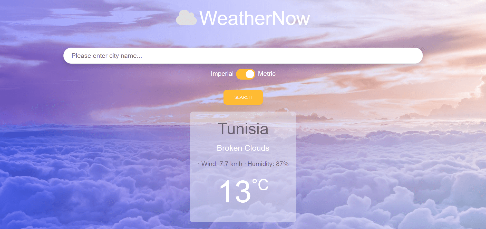

# WeatherNow


## Description

WeatherNow is a web application where a user can input any city name and get all weather information about that particular city. A user can chose between "Metric" or "Imperial" units for the weather data displayed. This webApp was built with javascript, bundled with Webpack along with the integration of two APIs : "OpenWeatherMap" and "Unsplash".

## Library Directory 📙

| Contents                    |
| --------------------------- |
| [Live Demo](#live-demo)     |
| [Screenshot](#screenshot)   |
| [Built With](#built-with-🛠) |
| [Authors](#authors)         |
| [License](#license)         |

## Live Demo

[Live demo](https://khalilhamdii.github.io/Weather_now/)

## Screenshot



## Built With 🛠

```
- HTML/CSS
- MDBoostrap
- Javascript
- Webpack
- OpenWeatherMap API
- VS Code
```

## Authors

### 👨‍💻 Khalil Hamdi

[](https://github.com/khalilhamdii) <br>
[](https://www.linkedin.com/in/khalilhamdi/) <br>
[](mailto:khaalil.hamdi@gmail.com) <br>
[](https://twitter.com/Khalilhamdiii)

### 🤝 Contributing

Contributions, issues and feature requests are welcome!

Feel free to check the [issues page](https://github.com/NtwaliHeritier/js-library).

### Show your support

Give a ⭐️ if you like this project!

### License


